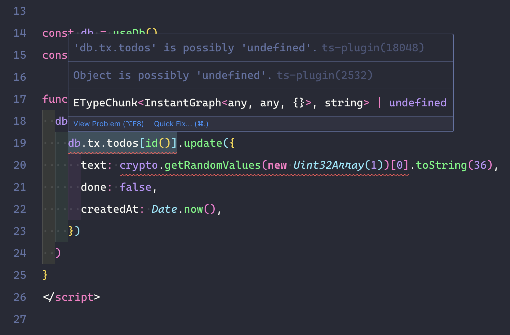
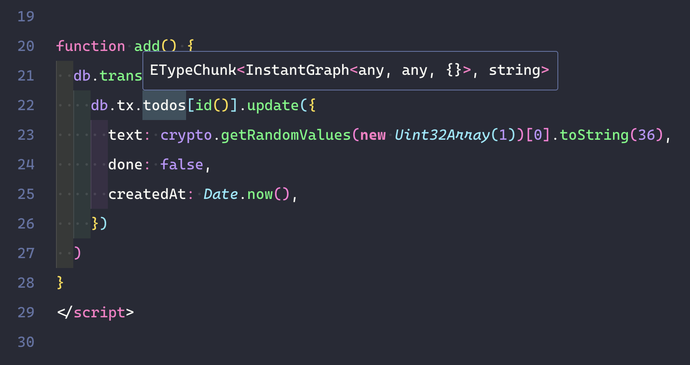

# Demo of TypeScript Warnings when using @dorilama/instantdb-vue with Nuxt 4

This demo is a reproduction of [Dorilama's Nuxt sandbox](https://github.com/Dorilama/instantdb-vue/tree/main/sandbox/nuxt) (there are a few minor formatting differences, but the setup is essentially the same).

The repo has two branches: `main` (which uses Nuxt 4 and leads to the warnings) and `nuxt-3` (which uses Nuxt 3 and does not lead to the warnings).

Both branches have the exact same code, only one uses the new Nuxt 4 folder stucture and the other doesn't.

## Warnings in Nuxt 4



## No warnings in Nuxt 3



---

## Note

To see the warnings in your IDE, you may need to refresh the generated types by stopping and restarting the dev server, especially after switching branches.

---

## Nuxt Minimal Starter

Look at the [Nuxt documentation](https://nuxt.com/docs/getting-started/introduction) to learn more.

### Setup

Make sure to install dependencies:

```bash
# npm
npm install

# pnpm
pnpm install

# yarn
yarn install

# bun
bun install
```

### Development Server

Start the development server on `http://localhost:3000`:

```bash
# npm
npm run dev

# pnpm
pnpm dev

# yarn
yarn dev

# bun
bun run dev
```
